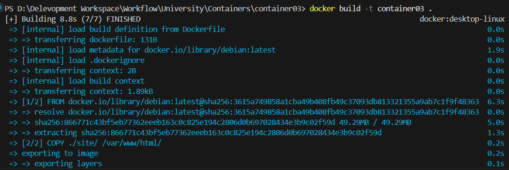
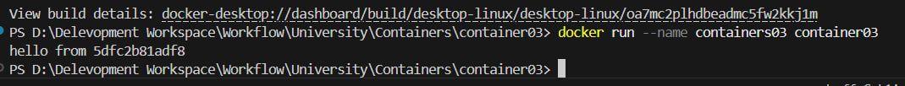
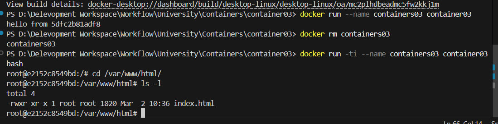

# Лабораторная работа №3 - Первый контейнер

## Цель работы

Данная лабораторная работа знакомит с основами контейнеризации и подготавливает рабочее место для выполнения следующих лабораторных работ.

## Задание

Установить Docker Desktop и проверить его работоспособность путем создания первого Docker контейнера на основе образа Debian с копированием файлов проекта.

## Описание выполнения работы

### 1. Подготовка окружения

Был установлен Docker Desktop и проверена его работоспособность.

### 2. Создание структуры проекта

В папке `containers03` была создана следующая структура:
- `Dockerfile` — файл с инструкциями для сборки образа
- `site/` — папка с веб-ресурсами
- `site/index.html` — HTML файл проекта

### 3. Содержимое Dockerfile

```dockerfile
FROM debian:latest
COPY ./site/ /var/www/html/
CMD ["sh", "-c", "echo hello from $HOSTNAME"]
```

Dockerfile описывает следующие операции:
- `FROM debian:latest` — использование последней версии образа Debian в качестве базы
- `COPY ./site/ /var/www/html/` — копирование папки site в контейнер по пути /var/www/html/
- `CMD ["sh", "-c", "echo hello from $HOSTNAME"]` — команда по умолчанию при запуске контейнера

### 4. Вопросы и ответы

#### Вопрос 1: Сколько времени создавался образ?

**Команда:**
```bash
docker build -t container03 .
```

**Время сборки:** 8.8 секунд

**Скриншот выхода команды:**




#### Вопрос 2: Что было выведено в консоли?

**Команда:**
```bash
docker run --name containers03 container03
```

**Вывод в консоли:**




Контейнер выполнил команду `echo hello from $HOSTNAME` и вывел в консоль сообщение "hello from [имя_контейнера]".

#### Вопрос 3: Что выводится на экране?

**Команды в контейнере:**
```bash
docker rm containers03
docker run -ti --name containers03 container03 bash
cd /var/www/html/
ls -l
```

**Вывод команды `ls -l`:**




В результате выполнения команды `ls -l` отображается содержимое папки `/var/www/html/`, в которой находится файл `index.html`, скопированный из локальной папки `site/`.

**Сведения о файле:**
- Файл `index.html` был успешно скопирован в контейнер
- Отображается информация о правах доступа, владельце и дате создания файла

### 5. Выход из контейнера

Контейнер был закрыт командой:
```bash
exit
```

## Выводы

1. Docker Desktop успешно установлен и работоспособен.

2. Docker позволяет легко создавать изолированные окружения (контейнеры) на основе определенных образов.

3. Dockerfile предоставляет декларативный способ описания содержимого образа и автоматизирует процесс его создания.

4. Команда `docker build` компилирует Dockerfile в образ, который можно многократно использовать для запуска контейнеров.

5. Интерактивный режим запуска контейнера (`docker run -ti ... bash`) позволяет исследовать содержимое контейнера и выполнять команды внутри него.

6. Процесс контейнеризации успешно демонстрирует изоляцию приложения и его зависимостей в отдельном окружении.

## Используемые источники

- [Документация по лабораторной работе](https://elearning.usm.md/mod/assign/view.php?id=282116&action=view)